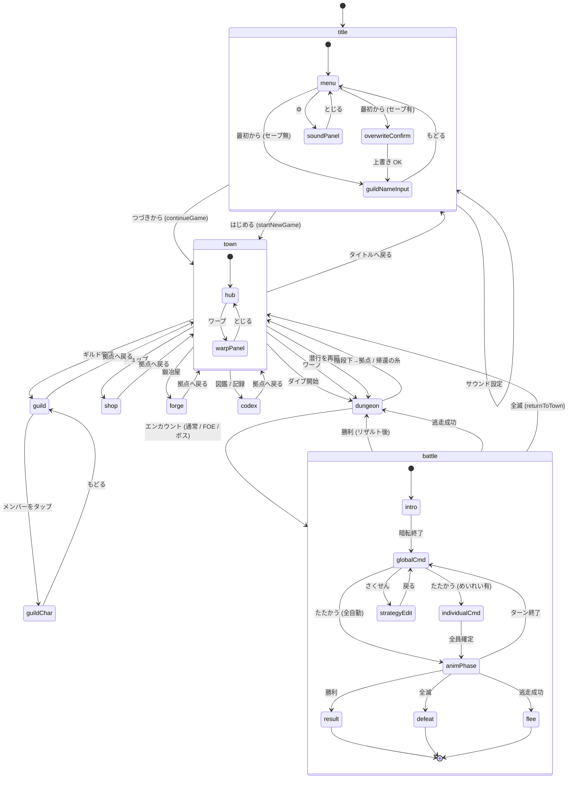

# Claude Design 用 機能・画面仕様ブリーフ

本ドキュメントは、本ゲーム（世界樹の迷宮ライクなブラウザ RPG）の**機能と既存画面の仕様**を、Claude Design に渡して**画面リニューアル案を考えてもらうための入力**としてまとめたものである。

- 目的: 「機能を網羅しつつ、現状の見た目に縛られない新しい画面デザイン」を Claude Design に提案してもらう。
- 立ち位置: 既存の見た目（写本テーマ）は**参考情報**として §10 にのみ記載する。原則として、Claude Design 側で**別のアートディレクションを提案してもらう前提**で書いている。
- 粒度: 各画面で「何のための画面か / 何を表示しているか / どんな操作ができるか / 状態分岐」が分かるよう、コード由来の事実を中心に書く。レイアウト指示は最小限。

---

## 1. ゲームの概要

- **ジャンル**: ダンジョン探索 + ターン制パーティバトル + キャラ育成（世界樹の迷宮系の DRPG）
- **テーマ**: 1 本の無限タワーに潜行し続ける構造（深層へ進むほどティアが上がる、ティア境界に階層ボス）
- **想定プラットフォーム**: スマートフォン縦（最大幅 560px / 100dvh）、PWA。本体はピュア React（API サーバなし）、永続化は IndexedDB（idb）
- **セーブスロット**: **1 枠固定**（複数セーブなし）
- **対象難易度**: 「少しハード」。装備作成・レベリング・編成の最適化を要する。
- **基本ループ**:
  1. 拠点（町）でパーティ編成・装備・補給
  2. ダンジョン（タワー）に潜行 → 探索・採集・FOE 回避・通常戦闘
  3. 階層ボス撃破でワープ解放・新ティアアンロック
  4. 拠点へ帰還 → 売買・鍛冶強化・転職/転生 → 再潜行

---

## 2. 全体システム（機能仕様）

### 2.1 2 つのモード（state machine）

| モード | 状態 | できること | できないこと |
|---|---|---|---|
| **拠点モード** | `save.diveState === null` | ギルド管理 / ショップ / 鍛冶 / 図鑑 / ダイブ開始 / ワープ / タイトルへ戻る | 戦闘 / マップ探索 |
| **潜行モード** | `save.diveState !== null` | ダイブ再開（dungeon 画面に直行）/ タイトルへ戻る | ギルド・ショップ・鍛冶・図鑑（全部 disabled） |

「潜行中は拠点機能が使えない」というのは UI 上で明確に表現する必要がある（disabled ボタン + ヒント文）。

### 2.2 ギルド & パーティ編成

| 概念 | 仕様 |
|---|---|
| ギルド団員上限 | **30 人** (`GUILD_MEMBER_LIMIT`) |
| 出撃パーティ上限 | **5 人** (`PARTY_MAX`) |
| 前衛枠 | **3** (`FORMATION_FRONT_SLOTS`) |
| 後衛枠 | **3** (`FORMATION_BACK_SLOTS`)。実出撃 5 人内で配分。後衛は近接被ダメ -30%。 |
| 控え | 編成外の団員 |
| 初期所持金 | **500 G** (`STARTING_GOLD`) |
| 名前最大長 | **16 文字** |
| ギルド名デフォルト | 「ななしのギルド」 |

### 2.3 キャラクター: 種族（6 種）

種族は素ステータス・成長傾向・属性/状態異常耐性・採集スキル・固有ユニオンを決める。

| ID | 表示名 | 役割タイプ | 概要 |
|---|---|---|---|
| `race_human` | ヒト | バランス | 全ステ平均 8、全方位対応、採集系（採掘・採取）持ち、デフォルト職: 戦士 |
| `race_garon` | ガロン | 物理アタッカー | STR/VIT 高、火弱点、毒・脚封じ耐性、デフォルト職: 拳聖 |
| `race_pix` | ピクス | 魔法アタッカー | INT/MND 高、TP プール大、物理弱点、魔法属性耐性、デフォルト職: 魔導士 |
| `race_therian` | テリアン | 手数 / AGI | AGI/LUC 高、氷弱点、脚封じ・盲目耐性、デフォルト職: 狩人 |
| `race_lunar` | ルーナ | ヒーラー | MND/INT/TP 寄り、HP 低、氷耐性 / 火弱点、デフォルト職: 薬師 |
| `race_golan` | ドーム | タンク | HP/VIT 高、AGI/INT 低、氷弱点、デフォルト職: 守護兵 |

### 2.4 キャラクター: 職業（9 種）

| ID | 表示名 | 役割 | 適性武器 | 適性防具 |
|---|---|---|---|---|
| `class_warrior` | 戦士 | 前衛物理アタッカー | 剣, 斧 | 重装, 軽装 |
| `class_guardian` | 守護兵 | タンク（盾・挑発・反撃） | 槍, 剣 | 重装 |
| `class_mage` | 魔導士 | 後衛魔法アタッカー（火/氷/雷） | 杖 | 衣類 |
| `class_ranger` | 狩人 | 射撃 / 部位封じ / 召喚 / 救護 | 弓, 素手 | 軽装, 衣類 |
| `class_medic` | 薬師 | メインヒーラー | 杖, 素手 | 衣類, 軽装 |
| `class_dancer` | 剣舞士 | 舞・歌・剣舞の支援アタッカー | 剣, 素手 | 軽装, 衣類 |
| `class_monk` | 拳聖 | 拳の多段攻撃 / 部位封じ / 反撃 | 素手 | 軽装, 重装 |
| `class_hexer` | 呪術士 | 状態異常 / 弱体デバッファー | 杖 | 衣類 |
| `class_summoner` | 降霊術士 | 召喚・障壁・爆裂 | 杖 | 衣類, 軽装 |

転職: 任意の職業に移行可能だが **Lv -5 のペナルティ** がかかり、職業/称号スキルは振り直し（種族スキルは保持）。

### 2.5 ステータス

8 種類 (`Stats`)。

| キー | 表示 | 意味 |
|---|---|---|
| `hp` | HP | 体力（0 で戦闘不能） |
| `tp` | TP | 技ポイント（スキル消費） |
| `str` | 腕力 | 物理攻撃の素 |
| `vit` | 体力 | 物理防御の素 |
| `agi` | 敏捷 | 行動順 / 命中 / 回避 |
| `int` | 知力 | 魔法攻撃の素 |
| `mnd` | 精神 | 魔法防御の素 |
| `luc` | 幸運 | 状態異常成否 / クリティカル |

### 2.6 レベリング・スキル・SP

| 項目 | 仕様 |
|---|---|
| レベル上限 | **100** (`BALANCE.LEVEL_CAP`) |
| 経験値カーブ | `expToNext(Lv) = round(14 * Lv^1.52)` |
| 素ステ計算 | `stat(Lv) = baseAtLv1 + statGrowth * (Lv - 1)` 線形 |
| SP 獲得 | 平均 1.62 SP / Lv（Lv100 で約 160 SP 累計） |
| スキルツリー | 職業 / 種族 / 称号 の 3 ツリー。前提チェーン有り。リスキル機構なし |
| アクティブスキル | 戦闘中に使う `BattleSkillDef`。TP 消費 |
| パッシブスキル | 常時補正（武器マスタリー等） |
| ユニオンスキル | 種族固有・複数人連携・ユニオンゲージ消費 |
| 採集スキル | フィールド用（採掘・採取・伐採・釣り・収穫・狩猟） |

スキル効果の種類: `damage`, `heal`, `restoreTp`, `ailment`, `buff`, `summon`, `counter`, `chase`, `decoy`, `barrier`, `cleanse`, `revive`, `regen` など。

### 2.7 称号

- **解放条件**: 第 20 階到達 (`UNLOCK.TITLE_DEPTH = 20`)
- 1 職業につき **2 つの選択肢**から 1 つ取得 → 第 2 スキルツリーが開く + 成長傾向補正 + SP+5 ボーナス
- 全 16 称号定義 (`src/data/titles.ts`)

### 2.8 転生

- **条件**: Lv100 到達 (`UNLOCK.REBIRTH_MIN_LEVEL = 100`)
- リセット: Lv1 へ。スキル Lv・装備は保持。
- 累積ボーナス: 全ステ合計 +240（種族成長で按分） + SP+10
- 改名 / 種族変更 / 職業変更が同タイミングで可能

### 2.9 装備

| 概念 | 仕様 |
|---|---|
| スロット数 | **3** (`weapon` / `armor` / `accessory`) |
| 武器種 | `sword` 剣 / `spear` 槍 / `axe` 斧 / `bow` 弓 / `staff` 杖 / `fist` 素手 |
| 防具種 | `heavy` 重装 / `light` 軽装 / `clothes` 衣類 |
| アクセサリ | 全職共通 |
| 個体管理 | `EquipInstance = { id, masterId, forgeLevel(0-5), grade }`。同じマスターでも個体ごとに保管。 |
| ティア (T0〜T5) | 進捗で解放される性能帯。`buyPrice = round(基準 × 2.2^tier)`。 |
| 周回グレード | Grade Lv が上がると `purchasePrice = buyPrice × (1 + 0.5*(grade-1))` |

### 2.10 鍛冶（forge）

- **強化**: 所有装備個体 + インゴット → forgeLevel +1〜+5（上限 +5）
  - 銅インゴット = +1 / 銀 = +3 / 金 = +5
  - forgeLevel × `(STAT_PER_LEVEL × TIER_STEP^tier)` を ATK/MAT または DEF/MDF に加算
- **分解（リサイクル）**: 装備 → 断片（fragments.common）
- **自動変換**: 断片 10 個 → 銅インゴット 1 個 (`FRAGMENTS_PER_INGOT = 10`)
- 一括分解（複数選択 → まとめて断片化）対応

### 2.11 アイテム

| 種別 | 内訳 | 特性 |
|---|---|---|
| 消費 | きずぐすり (HP+30, 最大 30 個スタック) / いいきずぐすり (HP+80, 最大 15) / まほうのは (TP 回復) など | `buyPrice > 0`、ショップ購入可、戦闘中・探索中使用 |
| 素材 | スライムゼリー / ねずみのしっぽ / ゴーレムの核 / 鉄鉱石 / 薬の葉 / 良質な木材 など | `buyPrice = 0`、売却専用。一部素材を売ると関連装備がショップに解放される |
| 食材 | 川魚 / 木の実 / 生肉 など | 採集・収穫・狩猟・釣りで入手。料理素材。倉庫枠別 (最大 60 個・売却不可) |
| 装備 | 上記 §2.9 | 個体管理 |

### 2.12 ショップ品揃え解放

- **ティア解放**: `floor(deepestReached / 10)` の階層分のみ。21 階突破でティア 2 解放。
- **素材売却解放** (`SELL_UNLOCKS`): 特定素材を売却すると関連装備が `shopStock.unlockedItemIds` に恒久追加。さらに売却した素材の周回グレードがその装備のショップ上のグレードを決める。
- 例: スライムゼリーを売る → equip_slime_shield 解放

### 2.13 戦闘システム

| 項目 | 仕様 |
|---|---|
| 形式 | ターン制サイドビュー（味方左 / 敵右） |
| 行動順 | 敵側 vs 味方側を AGI 平均で比較 → 1 ターン内で個別の AGI 順に解決 |
| 属性 | 8 属性: 斬 `slash` / 突 `pierce` / 壊 `bash` / 火 `fire` / 氷 `ice` / 雷 `volt` / 無 `almighty`（属性外） |
| 状態異常 | 10 種: 毒 `poison` / 麻痺 `paralysis` / 睡眠 `sleep` / 盲目 `blind` / 混乱 `confusion` / 呪い `curse` / 即死 `instantDeath` / 頭封じ `headBind` / 腕封じ `armBind` / 脚封じ `legBind` |
| クリティカル | LUC 補正で確率判定 |
| ガード（防御） | 待機。後衛行動時の物理被ダメ -30% |
| カウンター | `CombatState.kind='counter'` 持ちが被弾時に確率反撃 |
| 連携追撃 (chase) | 同属性ダメージ給付時に複数味方が追撃可能 |
| 障壁 (barrier) | ダメージを吸収。`consumeBarrier` で減算ログ表示 |
| 召喚体 | 最大 3 体（`MAX_SUMMONS`）。前列に並ぶ |
| ユニオン | 種族ごとの大技。ユニオンゲージ 100% で発動可、複数参加スキルあり |
| 全滅 | 味方全滅 → 拠点に帰還（所持金喪失は MVP 未実装） |
| 逃走 | AGI 比較で成否判定 |

### 2.14 戦闘 UI のフェイズ

1. **エンカウント演出**: 暗転 ≈ 700ms + `encounter` SE
2. **先制 / 不意打ち判定**: `firstStrike = 'preemptive' | 'ambush' | null`。ambush なら敵 1 巡自動行動
3. **コマンド入力 (uiMode = 'global')**: 「たたかう / さくせん / にげる」
   - 「たたかう」押下 → 非めいれいキャラは作戦から自動コマンド生成 (`pickAutoCommand`)、めいれいキャラが 1 人でもいれば個別 UI へ
4. **個別入力 (uiMode = 'individual')**: 「攻撃 / 防御 / スキル / アイテム」を順に。スキル → ターゲット選択（敵単体・全体・味方単体・自身）
5. **作戦変更 (uiMode = 'strategy')**: 各キャラに作戦割り当て
6. **行動解決フェイズ (anim)**: ログを 1 行ずつ表示、被弾キャラを点滅、ダメージ数値を InkSplatter で描画、対応 SE を再生
7. **勝利**: `BattleExpBar` で経験値バーアニメ → レベルアップダイアログを LIFO 積み上げ → リザルト（ドロップ / G）

### 2.15 作戦 (Strategy)

| 値 | ニュアンス |
|---|---|
| `gungan` | ガンガンいこうぜ — ダメージ最大化 |
| `batchiri` | バッチリがんばれ — バランス（デフォルト） |
| `inochi` | いのちをだいじに — 回復・防御優先 |
| `tpKeep` | TP つかうな — 0 TP スキル + 通常攻撃 |
| `meirei` | めいれいさせろ — 全コマンド自分で指定 |

### 2.16 タワー（ダンジョン）の構造

| 項目 | 仕様 |
|---|---|
| 構造 | 単一の無限タワー（1F, 2F, ... と昇る） |
| 1 階の階段下 | town に帰還 |
| ボス階 | 10F, 20F, 30F... を想定（ティア境界）。撃破まで上階段封鎖 (`canAscend = false`) |
| ワープ | ボス撃破で解放、`towerState.warp.unlockedCheckpoints` に追加 |
| ティア帯 | 0〜4 (T0〜T4)。階層が深いほど高ティア帯敵 / 装備 / 素材 |
| 生成 | `ensureFloor(depth)` で on-demand 生成 + `floorRng` で決定論的 |
| マップ | 2D グリッド + 一人称ビュー（疑似 3D 台形）の並行表示 |
| FOE | フロアごと `foeRuntime` で位置・defeated・alerted 管理。ターン制行動。接触で先制戦闘 |
| 採集 | `GatherType` = `mining` / `gathering` / `logging` / `fishing` / `harvest` / `hunting`。スキル要 |
| 帰還の糸 | `item_return_thread` 使用で town に即帰還 |
| エンカウント予兆 | 5 段階のゲージ。0 = 危機、5 = 安全 |

### 2.17 図鑑（codex）

- **モンスター図鑑**: 全 60 体（ボス 5 + tier0 11 + tier1〜4 各 9 ＝ 36 + 重複等）
- 段階表示:
  - 未遭遇: シルエット + 「？？？」+ 「第 N 帯」のみ
  - 遭遇済み・未撃破: 名前 + ドロップ列（未入手は「？」）
  - 遭遇済み・撃破: 上記 + 「撃破」バッジ + 詳細展開可（属性耐性・状態異常耐性）
- **到達記録**: 最深到達階 / 最高撃破ボス / 挑戦回数 / 図鑑達成率 / ボス撃破履歴（逆時系列）

### 2.18 セーブ / 永続化

- 保存先: **IndexedDB** (`idb`)、DB 名 `sekaiju-like-game`、ストア `saves`、キー `main`
- 保存タイミング: ニューゲーム開始 / ダイブ開始 / 階移動 / 戦闘終了 / 売買・装備変更
- `SaveData` の論理バージョン: `schemaVersion`（現在 v4）
- 主要フィールド:
  - `guild`: name, gold, members[], party, storage[], equipment[], foodStorage[], bestiary
  - `towerState`: floors, bossGates, warp, record
  - `diveState | null`: 潜行中なら現在地・パーティ等
  - `bestiary`: 後方互換ミラー
  - `playerMaps`, `exploredCells`: 階数ごとの手描きマップ・視認済みセル
  - `forgeInventory`: fragments / ingots
  - `shopStock`: unlockedTier, unlockedItemIds, unlockedGrades
  - `unlockedRecipeIds[]`, `flags`: 到達階等で立つ進行フラグ
- **セーブが破損した場合**: `SaveMeta.corrupted = true` を立てて title 画面で警告。新規開始のみ可。

---

## 3. 画面遷移図（Mermaid）



---

## 4. 画面仕様

各画面について「目的 / 表示要素 / 操作 / 状態分岐 / 既存ストーリー」を記述する。

### 4.1 title — タイトル / メインメニュー

#### 目的
- アプリ起動時の最初の画面。
- セーブの有無で「つづきから / 最初から」を分岐し、新規時はギルド名入力に遷移。

#### 表示要素
- **ヘッダー**
  - 章マーク（例: 「❦ 同見の書」）
  - タイトル（例: 「世界樹ライク」）
  - サブタイトル（例: 「無限タワー探索 RPG」）
  - 右上に⚙アイコン（サウンド設定パネル）
- **メインメニュー時**
  - メニュー上部の引用文（フレーバー）
  - SaveCard（**セーブ有のみ表示**）: ギルド名・最高到達階・団員数・最終セーブ日時
  - 「つづきから」ボタン（セーブ有のときのみ有効）
  - 「最初から」ボタン（セーブ有なら sub variant、無なら primary variant）
- **ギルド名入力時**
  - ダイアログタイトル「新しいギルド」
  - 入力フィールド（type=text、maxLength=16、placeholder=「ななしのギルド」、autoFocus）
  - 注意書き: 「冒険者はまだいません。開始後、ギルドメニューで仲間を作成してください。」
  - アクション: 「はじめる」/「もどる」
- **新規上書き確認ダイアログ時**
  - タイトル「最初から始めますか？」
  - 警告: 「現在のセーブデータ『{guildName}』は上書きされ、元に戻せません。」
  - アクション: 「データを消して始める」(danger) /「もどる」
- **フッター**
  - バージョン表記 v{__APP_VERSION__}
  - 「更新を確認」ボタン
  - AppUpdater バナー（has-update / up-to-date）
- **サウンド設定モーダル**
  - 半透明オーバーレイ + パネル（BGM / SE 音量、autoMap などの設定）
- **セーブ破損時**
  - SaveCard を corrupted 表示にして「セーブデータが破損しています」と表示。「つづきから」は無効。

#### ユーザーアクション一覧
| アクション | 条件 / 遷移 |
|---|---|
| ⚙ボタン | サウンド設定モーダル開閉 |
| つづきから | セーブ有・非破損のときのみ。`continueGame()` → town |
| 最初から | セーブ有 → 上書き確認ダイアログ。セーブ無 → ギルド名入力 |
| はじめる（ギルド名入力） | `startNewGame(name)` → town |
| もどる | メニューに戻る |
| 更新を確認 | `checkForUpdate()` → AppUpdater バナー |
| バナー「更新」 | `applyUpdate()` |

#### ストーリーで再現済みの状態
- `Title / NoSave`（mockEmpty）— 新規状態
- `Title / WithSave`（mockWithParty）— セーブ有

---

### 4.2 town — 拠点（街ハブ）

#### 目的
- 拠点モードの中央ハブ。
- ギルドの所属・所持金・進捗を表示し、各施設（ギルド / ショップ / 鍛冶 / 図鑑）とダイブへの導線を提供。

#### 表示要素
- **ヘッダー**
  - 章マーク「❦ 拠点」
  - ギルド名
  - 統計（横並びの dl）
    - 所持金 `{guild.gold} G`
    - 最高到達 `{deepestReached}F`（踏破済みのときのみ）
    - 団員 `{members.length} 人`
- **ヒント文（条件付き）**
  - 団員 0 人時: 「まずは『ギルド管理』で冒険者を作成してください。団員がいないとダイブできません。」
  - 潜行中: 「潜行中のため、ダイブ再開と『タイトルへ戻る』以外は利用できません。」
- **メニューボタンの縦リスト**（label / description / variant / disabled の条件は下記）

  | # | label | description（条件別） | primary / 制約 |
  |---|---|---|---|
  | 1 | ダイブ開始 / 潜行を再開 | `団員なし → '団員が必要です'` / `潜行中 → '{depth}F から再開'` / `通常 → '第1階からタワーへ潜る'` | primary。団員 0 で disabled |
  | 2 | ワープ | `checkpoints 0 → 'ボス撃破で解放'` / `潜行中 → '潜行中は使えません'` / `通常 → '解放済み: {depths}'` | 団員 0 / checkpoints 0 / 潜行中で disabled |
  | 3 | ギルド管理 | `潜行中 → '潜行中は使えません'` / `通常 → '編成・キャラ作成'` | 潜行中で disabled |
  | 4 | ショップ | 同上 / '装備・アイテム売買' | 潜行中で disabled |
  | 5 | 鍛冶屋 | 同上 / '装備の強化・リサイクル' | 潜行中で disabled |
  | 6 | 図鑑 / 記録 | 同上 / '到達記録・モンスター図鑑' | 潜行中で disabled |
- **フッター**
  - 「タイトルへ戻る」ボタン（vermilion 強調・確認ダイアログなし）
- **ワープモーダル**
  - 半透明オーバーレイ + パネル
  - タイトル「ワープ先を選択」
  - 各チェックポイントごとに「第 {depth} 階へ」ボタン
  - 「とじる」ボタン
- **ダイブ開始演出**
  - 封蝋スタンプ風 InkSplatter (`value='潜行', variant='seal', size=120`)
  - 320ms 後 dungeon へ遷移

#### 状態分岐
- 通常 / 潜行中 / 団員 0 / 全機能アンロック後（ワープ複数解放）

#### ストーリーで再現済みの状態
- `Town / EmptyGuild`（mockEmpty）— 団員 0、ハイント表示
- `Town / WithParty`（mockWithParty）
- `Town / MidDive`（mockMidDive）— F2 潜行中、再開・タイトル以外 disabled
- `Town / PostBoss`（mockPostBoss）— ワープ解放後

---

### 4.3 guild — ギルド管理

#### 目的
- ギルド団員の **CRUD** とパーティ編成を行う。
- 拠点モードでのみアクセス可。

#### 表示要素
- **ヘッダー**: タイトル「ギルド管理」+ `{members.length} / 30` 表示
- **タブ**（4 タブ）
  - `create` 作成
  - `roster` 一覧
  - `party` 編成
  - `banish` 追放
- **作成タブ**
  - 名前入力（maxLength=16, default 「名もなき冒険者」）
  - 種族選択カード（6 種）— 選択中の種族の `RaceInfoCard`（成長傾向 / 耐性 / 採集スキル / 推奨役割）
  - 職業選択カード（9 種）— 選択中の職業の `ClassInfoCard`（適性武具 / 概要）
  - プレビュー: 大ポートレート（60px）+ 表示名
  - 「作成する」ボタン（団員上限到達時 disabled、ラベル「団員が上限です」）
- **一覧タブ**
  - フィルター: 種族 / 職業（該当者のみのドロップダウン）
  - ソート: 作成順 / レベル↑↓
  - 各行: ポートレート(36px) + 名前 + 位置タグ（前衛 / 後衛 / 控え）+ 種族・職業・Lv + ➜ リンク（→ guildChar）
- **編成タブ**
  - 前衛セクション（3 スロット）
  - 後衛セクション（3 スロット、ラベル「近接ダメージ -30%」）
  - 出撃合計上限 5 を超える配置はブロック
  - 空きスロットタップ → 団員ピッカーオーバーレイ → 選択
  - 既編成スロットタップ → 「この枠を空ける」/「他のメンバーと入替」
- **追放タブ**
  - 全メンバー一覧 + 「追放」ボタン → 確認ダイアログ
- **フッター**: 「拠点へ戻る」

#### ストーリーで再現済みの状態
- `Guild / Empty`（mockEmpty）
- `Guild / WithMembers`（mockWithParty）

---

### 4.4 guildChar — キャラ詳細 / 育成

#### 目的
- 個別キャラの**ステータス・装備・スキル振り・転職・称号・転生**を 1 画面で完結させる。

#### 表示要素
- **ヘッダー**
  - 大ポートレート（56px）+ 名前 + 種族 / 職業 / Lv
- **ステータスセクション**（dl）
  - HP / TP / STR / VIT / AGI / INT / MND / LUC をラベル + 数値で表示
- **種族耐性セクション**（オプショナル）
  - 属性耐性: `ResistBadges`
  - 状態異常耐性: `ResistBadges`
  - どちらも無い種族 → 「この種族は特別な耐性を持ちません。」
- **装備セクション**（武器 / 防具 / 装飾の 3 スロット）
  - スロット名 + 装備名（未装備は「（なし）」）+ 「外す」ボタン
  - スロット対応の倉庫装備候補一覧 → 各候補に `ItemSprite(sm)` + 名前 + 「装備」ボタン
- **スキルセクション**
  - サブタブ: 職業 / 種族 / 称号（称号は習得済みのときのみ）
  - 右上: SP 残量「SP {sp}」
  - `SkillTree` コンポーネント（前提チェーンを線で可視化、ノード選択 → 下部に「習得」ボタン）
- **育成セクション**
  - 転職: ドロップダウン + 「転職する」ボタン（注意書き: 「レベルが 5 下がり、職業 / 称号スキルがリセットされます」）
  - 称号:
    - Lv 20 階未達 → 「第 20 階到達で習得できます（現在 {deepestReached}F）。」
    - 解放済み → 選択肢 2 個ボタン「{name}（SP+5）」
    - 取得済み → 「習得済み: {name}」
  - 転生:
    - Lv100 未達 → 「Lv100 以上で転生できます（現在 Lv{level}）。」
    - 達成 → 「転生する…」ボタンで展開フォーム
      - 説明 + 累積ボーナス表示 + 予定ボーナス（選択種族で計算）
      - 改名 / 種族選択 / 職業選択 / 「転生を実行」(danger) / 「やめる」
- **フッター**: 「もどる」（→ guild）

#### ストーリーで再現済みの状態
- `GuildChar / Default`（mockWithParty の最初のメンバー）

---

### 4.5 shop — ショップ

#### 目的
- 装備・消費アイテム・素材の**売買**。
- ティア解放と素材売却での品揃え拡張ロジックの UI 露出。

#### 表示要素
- **ヘッダー**
  - タイトル「ショップ」
  - 所持金 `{gold} G`
- **タブ**: 「買う」/「売る」
- **カテゴリ絞り込みチップ**（タブ内に存在するもののみ）
  - 「すべて / 武器 / 防具 / 装飾品 / アイテム / 素材」
- **並び替えセレクタ**: 金額が高い順 / 金額が安い順 / 所持数が多い順
- **リスト行**
  - `ItemSprite(sm)` + 名前（装備はタップで詳細モーダル）+ 説明（note or 所持数）+ 価格ボタン
- **装備詳細モーダル**
  - 装備名 + スロット + 武器 / 防具種
  - 性能: ATK / MAT / DEF / MDF + ステ補正
  - 装備可能職業バッジ
  - 購入価格 / 売却価格 / 所持数
- **購入 / 売却確認ダイアログ**
  - タイトル「{name} を購入しますか？」/「{name} を {price}G で売却しますか？」
  - 数量ステッパー（−1 / +1 / +10 / 最大）
    - 買う側上限: `floor(gold / price)`
    - 売る側上限: 所持数
  - 「購入する」/「売却する」ボタンで確定 → InkSplatter 演出
- **フッター**: 「拠点へ戻る」

#### 状態分岐
- ティア 0 のみ解放（序盤） / ティア複数解放 / 素材売却で個別装備解放されている / 売却タブで装備個体プールあり / 装備個体プール空

#### ストーリーで再現済みの状態
- `Shop / Default`（mockShop）

---

### 4.6 forge — 鍛冶屋

#### 目的
- 装備個体の**強化** と **分解（リサイクル）**。

#### 表示要素
- **ヘッダー**
  - タイトル「鍛冶屋」
  - インゴット在庫「銅 {n} ・銀 {n} ・金 {n}」+ 断片数「断片 {n}」
- **タブ**: 「強化」/「リサイクル」
- **ヒント文**
  - 強化: 「インゴットで装備を強化（最大 +5）。銅+1・銀+3・金+5。」
  - リサイクル: 「不要な装備を断片に変換。断片 10 個で銅インゴット 1 個になる。チェックで複数選択 → 一括分解。」
- **強化タブの行**
  - `ItemSprite(sm)` + 装備名（「短剣 +1」のように forgeLevel 付き）+ slot タグ
  - インゴットボタン 3 種（「銅+1(3)」「銀+3(1)」「金+5(0)」、在庫 0 で disabled）
  - 最大強化済み (+5) は「最大強化」ラベル
- **リサイクルタブの行**
  - `ItemSprite(sm)` + 名前 + 単発「分解（断片+N）」ボタン
  - 行頭にチェックボックス（一括選択用）
- **一括分解バー**（リサイクルで複数選択時に下部固定）
  - 「N 件選択・断片+M」
  - 「解除」/「一括分解」ボタン
- **強化 / 分解確認ダイアログ**
  - 「{name} を{ingot}で強化しますか？」/「{name} を分解しますか？（装備は失われます）」/「選択した N 件の装備を分解しますか？（断片 +M）」
  - 確定 → gold InkSplatter で「+N」演出
- **フッター**: 「拠点へ戻る」

#### ストーリーで再現済みの状態
- `Forge / Default`（mockForge）

---

### 4.7 codex — 図鑑 / 記録

#### 目的
- 到達記録と**モンスター図鑑**の収集状況確認。

#### 表示要素
- **ヘッダー**: タイトル「図鑑 / 記録」
- **タブ**: 「到達記録」/「図鑑」
- **到達記録タブ**
  - 大型表示: 最深到達階 `{deepestReached}F`
  - 統計（dl）: 最高撃破ボス階 / 挑戦回数 / 図鑑達成率 %
  - ボス撃破履歴（逆時系列）: 各行「N F のボス撃破」
- **図鑑タブ**
  - サマリ行: 「撃破 M/N ・ ドロップ P/Q」
  - 一覧（tierBand 昇順 + ID 昇順）
    - 未遭遇: `EnemySprite(silhouette=true)` + 「？？？」+ 「第 N 帯」のみ。展開不可
    - 遭遇済み・未撃破: スプライト + 名前 + 「第 N 帯」+ ドロップ列（未入手は「？」）+ ▼
    - 遭遇済み・撃破: 上記 + 「撃破」バッジ + ▼
  - 展開詳細（遭遇済みのみ）
    - 大型スプライト (lg)
    - 属性耐性: `ResistBadges`
    - 状態異常耐性: `ResistBadges` (`resolveEnemyAilmentResist` で敵専用耐性解決)
- **フッター**: 「拠点へ戻る」

#### ストーリーで再現済みの状態
- `Codex / Default`（mockWithParty）
- `Codex / PostBoss`（mockPostBoss）

---

### 4.8 dungeon — ダンジョン探索

#### 目的
- タワーを **一人称視界 + オートマップ** で探索。
- 移動・採集・調理・FOE 回避・帰還・メニュー操作の中心画面。

#### 表示要素
- **ヘッダー**
  - 深度表示（例: F2）
  - 帯テーマ名（ティア帯別カラー / フレーバー）
  - エンカウント予兆ゲージ `EncounterGauge`（5 段階。0 = 危機 / 5 = 安全。足跡 → ⚠ アイコン推移）
  - ☰ メニューボタン
- **一人称ビュー (`FirstPersonView`)**
  - 疑似 3D 台形描画（DEPTH_SCALE 0.56 で奥行きスケーリング）
  - 階段 / FOE / 採集ポイント / 調理スポット / ボスゲートを正面に描画
  - 移動コントロール（オーバーレイ）
    - ▲ 前進
    - ↰ 左ターン
    - ↱ 右ターン
    - ↻ 振り向き
- **オートマップ (`DungeonMap`)**
  - 探索済みセルのみ Canvas 描画（霧オフ）
  - プレイヤー三角形（向き付き）
  - 階段アイコン（▲ 上り / ▼ 下り）
  - FOE: alerted=true なら赤、未警戒は濃茶の円 + ! マーク
  - 採集ポイント: タイプ別絵文字（🌿 / ⛏ / 🪵 / 🎣 / 🌾 / 🏹）。枯渇は半透明
  - **タップで自動移動**: タップしたセルへ最短経路 (`pathTo`) を計算 → 1 歩ずつ自動進行 (`autoWalk`)、エンカウント時は中断
- **アクションボタン列**
  - ▲▼ 階段（上り / 下り / 帰還）
  - 🌿 採集（採集スキル習得者がいるとき表示）
  - 🍳 調理（アンロック済みレシピがあるとき表示）
- **メニューパネル**（☰ で開閉、`itemOverlay + itemPanel`）
  - 所持金表示
  - 🎒 どうぐ・食料（消費アイテム使用）
  - 🏠 拠点へ帰還（帰還の糸 / 階段 1F まで戻った場合の即帰還）
  - パーティ一覧（タップで詳細・スキル振り）
  - 設定 / セーブ
- **キャラ詳細パネル**（メニューからキャラタップ）
  - ステータス + `SkillTree`（職業 / 種族 / 称号タブ）→ 利用可能ならノード選択 + 習得ボタン
- **確認ダイアログ**（消費系操作: どうぐ使用 / 調理 / 帰還）
  - 「やめる / 使う」のシンプル 2 択

#### 探索イベント
- **FOE 戦闘トリガー**: FOE セル踏込 → 先制戦闘（ボスは先制なし）
- **採集成功**: 「○○ を手に入れた」ログ表示 + 採集 SE。失敗時は枯渇のみ進行
- **調理成功**: 食材消費 → 料理生成
- **アイテム入手**: 倉庫追加（消費 / 素材）または食料倉庫追加（食材）
- **帰還の糸** (item_return_thread): town へ即帰還

#### 階移動
- **下り (▲)**: 次階へ遷移。ボス階で未撃破なら封鎖 (`canAscend = false`)
- **上り (▼)**: 前階 or 1 階の階段なら拠点へ帰還
- **全滅**: 戦闘 outcome=lose → `returnToTown` で拠点へ
- **ボス入口**: 通常床に置かれる。踏込で boss 戦エンカウント

#### ストーリーで再現済みの状態
- `Dungeon / MidDive`（mockMidDive、F2 探索中）

---

### 4.9 battle — 戦闘

#### 目的
- ターン制戦闘の全行動を解決し、結果を反映する。
- ダンジョン中に発生する通常 / FOE / ボスの 3 形式に対応。

#### 表示要素
- **ヘッダー**
  - 章マーク「❦ 戦闘」
- **敵エリア**
  - 敵カード（flex-wrap）
  - boss / FOE: `EnemySprite(md)` + 名前
  - 雑魚: `EnemySprite(sm)` を横並び
  - ターゲット中の敵は枠ハイライト + 耐性コンパクト表示 (`ResistBadges compact`)
- **召喚体エリア**（あれば）
  - 最前列に最大 3 体表示。HP バー + 名前
- **味方エリア**
  - 前衛 / 後衛タグ + 2 段グリッド（1 段 3 列）
  - 各カードの内訳:
    - `CharacterPortrait` 立ち絵
    - 名前
    - 作戦短縮ラベル（ガ / バ / 命 / TP / 命令 等）
    - HP バー (`StatBar`)
    - TP バー (`StatBar`)
    - ユニオン% バー
    - コマンド入力状態（待機 / 入力中 / 確定）
    - 状態異常マーク（バインド 🔒 / その他 🌀）
    - 職業バッジ
- **戦闘ログ**
  - インラインプレビュー: 最新 3 行（fontSize 12px、高さ固定）
  - タップ → 全履歴オーバーレイ (`logOverlayBackdrop`、fixed backdrop + 最大高制御)
  - 逐次再生: anim フェーズで state.log[anim.revealed] まで順次表示
- **コマンド入力エリア**
  - **uiMode = 'global'**: 「たたかう / さくせん / にげる」
  - **uiMode = 'individual'**: activeId キャラに「攻撃 / 防御 / スキル / アイテム」
  - **uiMode = 'strategy'**: キャラごとに作戦リスト（gungan / batchiri / inochi / tpKeep / meirei）
  - スキル選択: `learnedSkillsList` を 2 列で描画。TP 不足 / 制限はグレーアウト
  - ターゲット選択: 敵カードタップで targetId 切替（スキル種別が allyOne なら味方カードから選択）
- **演出**
  - エンカウント時の暗転 (≈700ms)
  - ダメージ / 回復 / 会心の `InkSplatter` (variant='damage' / 'heal' / 'crit')
  - 被弾キャラの flashIds 点滅
- **リザルト画面**
  - 経験値バー (`BattleExpBar`、EXP_ANIM_MS=1000ms)
  - レベルアップダイアログを LIFO 積み上げ（各ダイアログで STAT_LABEL 旧値 → 新値）
  - ドロップ / 獲得 G 表示 (+ gold InkSplatter)
- **敗北画面**
  - 全滅 → 「拠点へ戻る」演出。
- **逃走画面**
  - 逃走成功 → ダンジョンへ復帰

#### ユーザーアクション
- 「たたかう」: 自動 or 個別 UI へ
- 「さくせん」: 作戦変更モード
- 「にげる」: AGI 比較 → 成功でダンジョンへ、失敗で敵フリー行動
- 個別キャラの「攻撃 / 防御 / スキル / アイテム」
- スキル詳細 → ターゲット選択 → 確定
- 戦闘ログタップで全履歴

#### 戦闘ルール（要点・再掲）
- 8 属性、10 状態異常
- 速度順 = AGI、味方 / 敵を平均 AGI で先行決定 → 各個 AGI 順
- ガード（防御）/ カウンター / 連携追撃 / 障壁 / 召喚 / ユニオン
- 全滅 → returnToTown / 勝利 → リザルト → ダンジョン復帰 / 逃走 → ダンジョン復帰

#### ストーリーで再現済みの状態
- `Battle / Default`（mockBattle、F2 雑魚 6 体 + 味方 5 名）
- `Battle / SkillMenu`（戦士のスキル選択中）
- `Battle / Strategy`（作戦変更中）

---

### 4.10 not-found — 404 フォールバック

#### 目的
- 未知の screen.name に遷移したときの fallback。通常は到達しない（デバッグ / 不正遷移時のみ）。

#### 表示要素
- 章マーク「❦ 行方知れずの頁」
- ボディ「お探しのページは見つかりませんでした。」
- 「戻る」ボタン（`history.back()`）

---

## 5. 横断的に登場する UI 要素（凡例）

これらは全画面で再利用される共通部品なので、リニューアル後の語彙も**同じ意味を持つ部品の名前で表現してほしい**。

| 部品 / 概念 | 用途 | 主な登場画面 |
|---|---|---|
| `SaveCard` | セーブメタの 1 カード表示（ギルド名・最深階・団員数・更新時刻） | title |
| `MenuButton` | 縦リストの大ボタン（label + description + variant: primary/sub/danger） | title, town, guild, guildChar |
| `StatBar` | HP / TP / ユニオン% などのバー（value / max + 数値オプション + アニメ） | battle, dungeon メニュー |
| `EncounterGauge` | 5 段階のアイコン + ゲージ。0=危機〜5=安全 | dungeon |
| `ResistBadges` | 属性 / 状態異常の耐性をバッジで一覧（compact モード有） | guildChar, codex, battle ターゲット表示 |
| `SkillTree` | 前提チェーンを線で繋いだスキルツリー（ノード選択 + 習得ボタン分離） | guildChar, dungeon キャラ詳細 |
| `InkSplatter` | アクション結果の数値演出（damage / heal / crit / seal / gold） | battle, forge, shop, town（ダイブ） |
| `EnemySprite` | 敵 1 体の絵（sm / md / lg）+ silhouette モード | battle, codex, dungeon の FOE 表示 |
| `ItemSprite` | アイテム / 装備 1 件の絵（sm / md / lg）+ ティア別色相回転 | shop, forge, guildChar 装備 |
| `CharacterPortrait` | キャラ立ち絵（race × class の 54 種類のうち 1 枚） | guild, guildChar, battle, dungeon |
| `BattleExpBar` | 経験値バーアニメ（EXP_ANIM_MS=1000ms） | battle リザルト |
| `FirstPersonView` | 疑似 3D 一人称視界（台形 + 階段 / FOE / 採集の正面描画） | dungeon |
| `DungeonMap` | Canvas オートマップ（探索済みセルのみ・タップで autoWalk） | dungeon |
| `AppUpdater` | アプリ更新通知バナー（has-update / up-to-date） | title |

### 効果音 (SFX) のフック先（リネーム可だが、対応する音は欲しい）

| ID | 起こる事象 |
|---|---|
| `decide` | メニュー決定 |
| `cancel` | メニューキャンセル / もどる |
| `cursor` | カーソル移動 |
| `encounter` | エンカウント演出開始 |
| `attack` / `damage` / `critical` | 攻撃ヒット / 被弾 / 会心 |
| `heal` / `buff` / `debuff` | 回復 / 強化 / 弱体 |
| `skill` | 汎用スキル発動 |
| `victory` / `defeat` / `flee` | 戦闘終了の各分岐 |
| `levelup` | レベルアップダイアログ |
| `dive` / `warp` | 階移動 |
| `save` | セーブ完了 |
| `item` / `cook` / `create` | 採集 / 調理 / 作成 |

---

## 6. 数値・上限・分岐の早見表

| 値 | 名前 |
|---|---|
| 500 G | 初期所持金 (`STARTING_GOLD`) |
| 30 人 | ギルド団員上限 (`GUILD_MEMBER_LIMIT`) |
| 5 人 | 出撃パーティ最大 (`PARTY_MAX`) |
| 3 / 3 | 前衛 / 後衛 枠（合計 5 内で配分） |
| 16 文字 | キャラ名 / ギルド名 maxLength |
| 100 | レベル上限 (`LEVEL_CAP`) |
| 20 階 | 称号解放 (`UNLOCK.TITLE_DEPTH`) |
| 100 | 転生条件 Lv (`UNLOCK.REBIRTH_MIN_LEVEL`) |
| +5 | 鍛冶強化上限 (`FORGE.MAX_LEVEL`) |
| +1 / +3 / +5 | 銅 / 銀 / 金 インゴット強化値 |
| 10 | 断片 → 銅インゴット変換比 (`FRAGMENTS_PER_INGOT`) |
| 60 個 | 食料倉庫上限 |
| 60 体 | モンスター図鑑総数 |
| 8 / 10 | 属性数 / 状態異常数 |
| 3 / 5 | MAX_SUMMONS / EncounterGauge ステージ数 |
| 320ms | town → dungeon ダイブ演出時間 |
| 700ms | 戦闘エンカウント暗転時間 |
| 1000ms | BattleExpBar アニメ時間 |

---

## 7. 想定スクリーンサイズ

- **iPhone SE 縦（375 × 667）以上**に常時収まること。
- 横方向は **max-width: 560px** で中央寄せ（PC でも幅 560px の中身が表示される）。
- 全画面: `100dvh` ・ HTML / body は `overflow: hidden`（誤スクロール / バウンス抑止）。
- 各ページは内部で **header / main / footer の縦 3 段**を基本とし、main セクションのみスクロール可。
- 安全領域: `safe-area-inset-bottom` を必ず加算（iPhone のホームインジケータ被り対策）。フッターボタンが触れない事故を再発させない。
- 最小タップ領域: 44〜48px。

---

## 8. レスポンシブとアクセシビリティ

- **タッチ操作前提**: hover で出る情報を持たせない。
- `touch-action: pan-y` で誤タップ防止。
- `prefers-reduced-motion: reduce` のとき全アニメ 0ms。
- セマンティック HTML（h1〜h3、dl、button）を使う。 SVG / Canvas を使う場合も `<button>` で囲む。
- 戻る操作の物理的位置を一貫させる（既存は footer 中央〜右下）。
- 入力フィールドはモバイルキーボードを意識（autoFocus、inputMode、enterkeyhint など）。

---

## 9. 「リニューアルしたい」/「変えないでほしい」境界

リデザインで**動かしてほしい / 動かしてほしくない**ものを明示する。

### 9.1 リデザインで動かしてほしい
- カラーパレット / フォント / ボタンの形 / 余白
- ヘッダー・フッターの構造（ただし「戻る」の位置は一貫させる）
- 戦闘画面の敵 / 味方のレイアウト（縦並び・カルーセル等の別案歓迎）
- 戦闘ログの表現（インライン or オーバーレイ）
- 演出（暗転・スプラッシュ・揺れ・効果音呼び出しのタイミング）
- メニューのアフォーダンス（ボタンリスト → アイコングリッド等）

### 9.2 動かしてはいけない（機能要件）
- §2 の全機能（モード遷移・パーティ規模・職業/種族・スキル体系・装備個体・鍛冶・戦闘ルール）
- §3 の画面遷移グラフ（10 画面の責務と接続関係）
- §6 の数値（上限・カーブ・閾値）
- 「潜行中は拠点機能が disable される」という制約
- セーブ 1 枠固定
- IndexedDB 永続化前提（API サーバなし）

### 9.3 弱い制約（変えたいなら一声）
- 拠点メニューの並び順
- 作戦の名前 / 略称
- タブ名（ショップの「買う / 売る」、ギルドの 4 タブ等）

---

## 10. 既存デザインの参考情報（=** リニューアル前**の状態）

> 本セクションは「現状こうなっている」という参考。Claude Design 側で**置き換える前提**。

- **テーマ名**: 「写本（Illuminated Codex）」
- **カラーパレット**
  - 紙地 parchment `#EDE3CC`
  - 墨 ink `#21241B`
  - 製本緑 verdant `#3F6B4A`
  - 金箔 illumination-gold `#B89255`
  - 封蝋朱 vermilion `#B22C2C`
- **タイポグラフィ**
  - 本文: Noto Sans JP
  - 装飾 / 見出し: Kaisei Tokumin（明朝風 serif）
  - 数値: JetBrains Mono
- **線**: 0.75px の border、角丸 0
- **アクセント**: 章マーク（❦）、引用文、封蝋 InkSplatter、ページめくり遷移演出（PageTurn）
- **モーション**: --motion-quick 140ms / --motion-base 220ms / --motion-emphasis 280ms / --motion-page 260ms

これらは**捨てて構わない**。リデザインで別のアートディレクション（例: SF / モダンミニマル / ファンタジー水彩 / ピクセル風）に変えてもよい。ただし上記カラーパレットの「機能的役割」（成功 / 危険 / 通常 / 強調）が読み取れる代替を必ず用意してほしい。

---

## 11. リニューアル依頼テンプレ（Claude Design 用）

Claude Design に投げるときの**初期プロンプトのひな型**。本ドキュメントと併せて使ってほしい。

```
本ゲーム「世界樹の迷宮ライクなブラウザ RPG」の画面を全面リデザインしたい。
機能・画面仕様は添付の claude-design-brief.md を参照。

設計上の固定要件:
- スマホ縦 (375x667 〜 iPhone Pro Max) で完結。
- React で実装可能な範囲のレイアウト（Web Components ベース）。
- セーブ 1 枠固定 / IndexedDB / API サーバなし。

リデザインで動かしてほしい / 動かしてほしくない範囲は brief の §9 を参照。

まずは下記の手順で進めてほしい:
1. アートディレクション 3 案を提示（言語化 + 一枚絵 or color block）
2. 私がそのうち 1 案を選ぶ
3. 選んだ方向で「title」「town」「battle」3 画面を試作
4. 私がフィードバック → 残り 7 画面を順に試作
```

---

## 12. 補足: コードへの逆引きしやすさ

ブリーフ起点で「実装はどこ？」を辿りやすいよう、主要な参照先を併記する。

| トピック | 主な参照ファイル |
|---|---|
| 画面ナビゲーション | `src/store/navigation.tsx`, `src/App.tsx` |
| セーブ / 永続化 | `src/store/saveStore.ts`, `src/domain/saveData.ts`, `src/store/gameState.tsx` |
| 型定義 | `src/domain/types.ts` |
| バランス定数 | `src/data/balance.ts` |
| 職業 / 種族 / 称号 / スキル | `src/data/classes.ts`, `races.ts`, `titles.ts`, `skills.ts` |
| 装備 / アイテム / 敵マスター | `src/data/equipment.ts`, `items.ts`, `enemies.ts` |
| ダンジョン探索 | `src/domain/dive.ts`, `src/domain/encounter.ts`, `src/pages/dungeon/` |
| 戦闘 | `src/domain/battle.ts`, `src/domain/strategy.ts`, `src/pages/battle/` |
| 鍛冶 / ショップ / 図鑑 | `src/domain/forge.ts`, `shop.ts`, `codex.ts`, `src/pages/forge|shop|codex/` |
| Storybook mock | `src/__stories__/mockSaves.ts`, `src/__stories__/decorators.tsx` |

---

(本ドキュメントは Claude Code セッションでコードを読み取った内容に基づいて作成された。仕様変更があった場合は、本ファイルも更新すること。)
